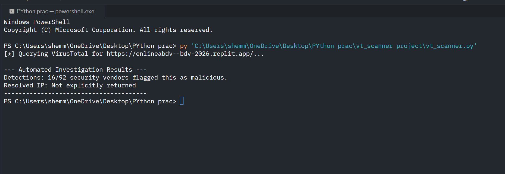

# Automated Phishing Investigation & IOC Extraction

## Project Overview
This project demonstrates a real-world Security Operations Center (SOC) workflow for triaging malicious emails. It involves analyzing an active phishing campaign, tracing the underlying attack infrastructure, and automating threat intelligence lookups using Python.

##  Objectives
- Safely extract and analyze phishing URLs using sandboxed environments.
- Automate Indicators of Compromise (IOC) gathering using the VirusTotal API.
- Trace attack infrastructure (IPs, ASNs, hosting platforms).
- Compile a professional Incident Report with actionable remediation steps.

##  Tools & Technologies Used
- **Python (requests, python-dotenv):** For API automation and secure credential management.
- **VirusTotal API v3:** For automated malicious file/URL detection.
- **PhishTank:** For sourcing live threat data.
- **OSINT Tools:** WHOIS and IP reconnaissance.

 The Automation Script
To eliminate manual web interface lookups, I developed `vt_scanner.py`, a lightweight Python tool that queries the VirusTotal API to return detection scores and resolved IP addresses for malicious URLs.

### Usage
1. Clone the repository.
2. Install dependencies: `pip install requests python-dotenv`.
3. Copy `.env.example` to `.env` and add your VirusTotal API key.
4. Run the script: `python vt_scanner.py`

  

## Incident Report
The full analysis of the Banco de Venezuela (BDV) credential harvesting campaign, including extracted IOCs and remediation recommendations, can be found in the [reports directory](reports/IOC_Report_Replit_Phish.md).

## Key Takeaways
- **Secure Code Practices:** Implemented environment variables (`.env`) to prevent hardcoded API keys from leaking into version control.
- **Cloud Infrastructure Abuse:** Identified how threat actors leverage free cloud hosting platforms (like Replit) to generate valid SSL certificates and evade basic domain reputation filters.
